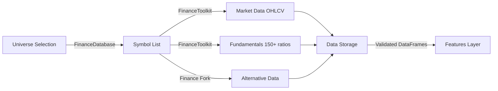
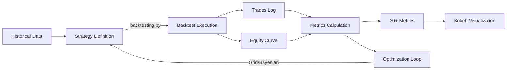
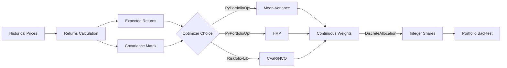
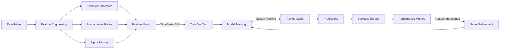
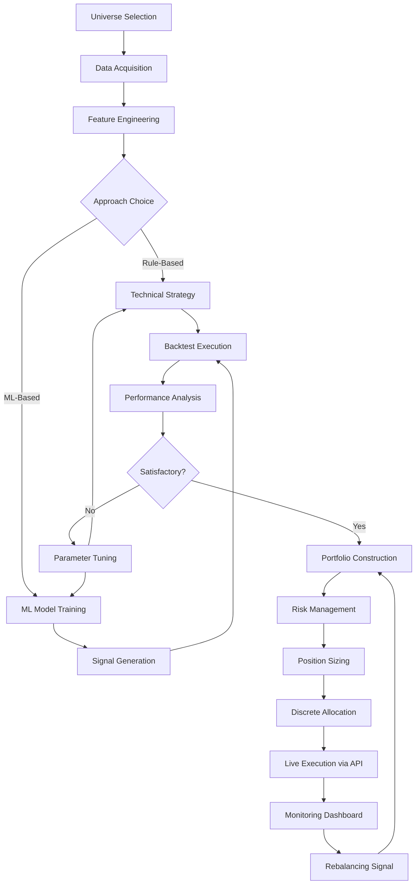

# 🏗️ Architecture FinBot v2.0

## 📋 Vue d'ensemble

FinBot est une plateforme d'analyse quantitative modulaire qui intègre les meilleures librairies open-source du domaine finance/ML. L'architecture suit le principe **"Best-of-breed"** : utiliser directement les libs existantes plutôt que de réinventer la roue.

### Philosophie de conception

1. **Modularité** : Chaque module est indépendant et peut être utilisé séparément
2. **Extensibilité** : Facile d'ajouter de nouveaux indicateurs, stratégies, modèles
3. **Réutilisabilité** : Wrapping minimal des libs externes pour harmoniser l'API
4. **Performance** : Vectorisation pandas/numpy, cache intelligent, lazy loading
5. **Testabilité** : Mocks pour toutes les APIs externes, TimeSeriesSplit pour ML

---

## 🌳 Arborescence complète

```
finbot/
├── .github/
│   └── copilot-instructions.md          # Conventions de code v2.0
│
├── docs/
│   ├── AUDITS/                          # 272 KB d'audits techniques
│   │   ├── INDEX_COMPLET_AUDITS.md      # Vue d'ensemble des audits
│   │   ├── SUMMARY_AUDIT_FINBOTX.md     # Résumé exécutif
│   │   ├── AUDIT_BACKTESTING_PY.md      # Framework vectorisé
│   │   ├── AUDIT_FINANCEDATABASE.md     # 300K+ symboles
│   │   ├── AUDIT_FINANCETOOLKIT.md      # 150+ ratios
│   │   ├── AUDIT_FINANCE_FORK.md        # 150 programmes
│   │   ├── AUDIT_PYPORTFOLIOOPT.md      # Optimisation MV, HRP, BL
│   │   ├── AUDIT_RISKFOLIO.md           # 24 mesures de risque
│   │   └── AUDIT_ML4T.md                # Workflows ML complets
│   ├── ARCHITECTURE.md                  # ← Ce fichier
│   ├── INTEGRATION_PLAN.md              # Plan d'intégration par phases
│   └── API_REFERENCE.md                 # Référence complète des APIs
│
├── src/financial_analyzer/
│   ├── __init__.py
│   ├── config.py                        # Configuration centralisée
│   │
│   ├── utils/                           # Utilitaires transverses
│   │   ├── __init__.py
│   │   ├── helpers.py                   # Logging, validation, cache
│   │   ├── cache.py                     # Cache Redis/Disk
│   │   └── validators.py                # Validation DataFrames
│   │
│   ├── data/                            # Acquisition de données
│   │   ├── __init__.py
│   │   ├── universe.py                  # FinanceDatabase wrapper (300K+ symboles)
│   │   ├── market_data.py               # FinanceToolkit + yfinance (OHLCV)
│   │   ├── fundamentals.py              # FinanceToolkit (150+ ratios)
│   │   └── alternative.py               # Finance fork scrapers (news, sentiment)
│   │
│   ├── features/                        # Feature engineering
│   │   ├── __init__.py
│   │   ├── technical.py                 # Finance fork (40+ indicateurs TA)
│   │   ├── fundamental.py               # FinanceToolkit ratios transformés
│   │   ├── alpha_factors.py             # ML4T (100+ alpha factors)
│   │   └── sentiment.py                 # FinBERT NLP (news/social media)
│   │
│   ├── strategies/                      # Stratégies de trading
│   │   ├── __init__.py
│   │   ├── technical/                   # Stratégies techniques
│   │   │   ├── __init__.py
│   │   │   ├── momentum.py              # Finance fork (SMA, EMA crossovers)
│   │   │   ├── mean_reversion.py        # RSI, Bollinger, pairs trading
│   │   │   └── trend_following.py       # MACD, ADX, breakout
│   │   ├── quantitative/                # Stratégies quantitatives
│   │   │   ├── __init__.py
│   │   │   ├── statistical_arbitrage.py # Cointegration, pairs
│   │   │   ├── factor_models.py         # Fama-French, PCA
│   │   │   └── risk_parity.py           # Equal risk contribution
│   │   └── ml_based/                    # Stratégies ML
│   │       ├── __init__.py
│   │       ├── predictive.py            # ML predictions → signals
│   │       └── reinforcement.py         # DQN, PPO agents
│   │
│   ├── backtesting/                     # Moteur de backtesting
│   │   ├── __init__.py
│   │   ├── engine.py                    # backtesting.py wrapper
│   │   ├── strategies/                  # Implémentations Strategy classes
│   │   │   ├── __init__.py
│   │   │   ├── base.py                  # BaseStrategy avec helpers
│   │   │   ├── technical_strategies.py  # SMA, RSI, MACD strategies
│   │   │   └── ml_strategies.py         # ML-based strategies
│   │   └── optimize.py                  # Grid search + Bayesian optimization
│   │
│   ├── portfolio/                       # Optimisation de portefeuille
│   │   ├── __init__.py
│   │   ├── optimizer.py                 # PyPortfolioOpt wrapper (MV, HRP, BL)
│   │   ├── risk_optimizer.py            # Riskfolio-Lib wrapper (CVaR, NCO)
│   │   ├── allocation.py                # DiscreteAllocation (integer shares)
│   │   └── rebalancing.py               # Stratégies de rebalancing
│   │
│   ├── risk/                            # Gestion des risques
│   │   ├── __init__.py
│   │   ├── metrics.py                   # VaR, CVaR, drawdown, Sharpe
│   │   ├── stress_testing.py            # Worst-case scenarios, Monte Carlo
│   │   ├── factor_models.py             # Fama-French, PCA exposure
│   │   └── position_sizing.py           # Kelly criterion, risk parity
│   │
│   ├── ml/                              # Machine Learning
│   │   ├── __init__.py
│   │   ├── models/                      # Modèles de prédiction
│   │   │   ├── __init__.py
│   │   │   ├── timeseries.py            # ARIMA, Prophet, LSTM
│   │   │   ├── tree_based.py            # XGBoost, LightGBM, RandomForest
│   │   │   └── neural_nets.py           # LSTM, GRU, Transformer
│   │   ├── ensemble.py                  # Model stacking, blending
│   │   ├── deep_rl.py                   # DQN, PPO, A3C agents
│   │   └── feature_selection.py         # Recursive feature elimination
│   │
│   ├── analysis/                        # Analyse & valorisation
│   │   ├── __init__.py
│   │   ├── backtester.py                # ✅ BacktestEngine (Semaine 3)
│   │   ├── ml_predictor.py              # ✅ MLPredictor (Semaine 3)
│   │   ├── valuation.py                 # DCF, DDM, WACC (FinanceToolkit)
│   │   ├── options.py                   # Black-Scholes, Greeks (FinanceToolkit)
│   │   └── performance.py               # Sharpe, Sortino, Alpha, Beta
│   │
│   ├── api/                             # REST API
│   │   ├── __init__.py
│   │   ├── main.py                      # FastAPI app
│   │   ├── routes/                      # Endpoints par module
│   │   │   ├── __init__.py
│   │   │   ├── data.py                  # /api/data/*
│   │   │   ├── backtest.py              # /api/backtest/*
│   │   │   ├── portfolio.py             # /api/portfolio/*
│   │   │   └── ml.py                    # /api/ml/*
│   │   └── models/                      # Pydantic schemas
│   │       ├── __init__.py
│   │       ├── requests.py              # Request models
│   │       └── responses.py             # Response models
│   │
│   └── dashboard/                       # Web UI
│       ├── __init__.py
│       ├── streamlit_app.py             # Main Streamlit app
│       └── components/                  # UI components
│           ├── __init__.py
│           ├── data_explorer.py         # Data visualization
│           ├── backtest_viewer.py       # Backtest results
│           ├── portfolio_builder.py     # Portfolio construction
│           └── ml_dashboard.py          # ML model performance
│
├── tests/                               # Tests unitaires
│   ├── __init__.py
│   ├── conftest.py                      # Fixtures globales
│   ├── test_data/                       # Tests data layer
│   ├── test_features/                   # Tests feature engineering
│   ├── test_backtesting/                # Tests backtesting
│   ├── test_portfolio/                  # Tests portfolio optimization
│   ├── test_ml/                         # Tests ML models
│   ├── test_analysis.py                 # ✅ Tests analysis (Semaine 3)
│   └── test_api/                        # Tests API endpoints
│
├── notebooks/                           # Jupyter exploratoires
│   ├── examples/                        # Exemples d'utilisation
│   │   ├── 01_data_acquisition.ipynb
│   │   ├── 02_feature_engineering.ipynb
│   │   ├── 03_backtesting.ipynb
│   │   ├── 04_portfolio_optimization.ipynb
│   │   ├── 05_ml_pipeline.ipynb
│   │   └── 06_full_pipeline.ipynb
│   └── research/                        # Recherche & exploration
│
├── docker/                              # Configurations Docker
│   ├── Dockerfile
│   ├── docker-compose.yml
│   └── .dockerignore
│
├── .env.example                         # Template variables d'environnement
├── .gitignore
├── requirements.txt                     # Dépendances Python
├── setup.py                            # Configuration package
├── pytest.ini                          # Configuration pytest
└── README.md                           # Documentation principale
```

---

## 🔄 Diagrammes de Flow

### 1. Data Pipeline



**Description** :
1. **Universe Selection** : Sélection de symboles via FinanceDatabase (sector, market_cap, exchange filters)
2. **Market Data** : Récupération OHLCV via FinanceToolkit + yfinance (fallback)
3. **Fundamentals** : 150+ ratios financiers via FinanceToolkit
4. **Alternative Data** : News, sentiment via scrapers Finance fork
5. **Storage** : DataFrames validés (DatetimeIndex, colonnes OHLCV standard)
6. **Features** : Prêts pour feature engineering

---

### 2. Backtesting Pipeline



**Description** :
1. **Historical Data** : OHLCV DataFrame avec DatetimeIndex
2. **Strategy** : Classe héritant de `backtesting.Strategy` avec `init()` et `next()`
3. **Execution** : Moteur vectorisé backtesting.py (ultra-rapide)
4. **Trades Log** : Liste exhaustive des trades avec entry/exit/PnL
5. **Equity Curve** : Évolution du capital dans le temps
6. **Metrics** : Sharpe, Sortino, Win Rate, Max Drawdown, Calmar, etc.
7. **Visualization** : Graphiques interactifs Bokeh
8. **Optimization** : Grid search ou Bayesian pour tuning paramètres

---

### 3. Portfolio Pipeline



**Description** :
1. **Prices** : Multi-ticker DataFrame (colonnes = tickers)
2. **Returns** : Simple ou log returns
3. **Expected Returns** : Mean historical, CAPM, Black-Litterman
4. **Covariance** : Sample, Ledoit-Wolf, semi-covariance
5. **Optimizer** : 
   - **PyPortfolioOpt** : Mean-Variance, HRP, Black-Litterman, CLA
   - **Riskfolio-Lib** : CVaR, NCO, Worst-case (24 risk measures)
6. **Weights** : Allocation continue [0, 1] sommant à 1
7. **Discrete Allocation** : Conversion en nombre d'actions entières
8. **Backtest** : Validation performance du portfolio

---

### 4. ML Pipeline



**Description** :
1. **Raw Prices** : OHLCV DataFrame
2. **Feature Engineering** :
   - **Technical** : 40+ indicateurs (SMA, RSI, MACD, etc.)
   - **Fundamental** : 150+ ratios transformés (PE, ROE, etc.)
   - **Alpha Factors** : 100+ factors ML4T (momentum, value, quality)
3. **Feature Matrix** : X (features) × y (target: returns/labels)
4. **TimeSeriesSplit** : Validation temporelle (JAMAIS random split)
5. **Training** : sklearn Pipeline (StandardScaler → Model)
6. **Predictions** : Forward pass sur test set
7. **Signals** : Conversion predictions → trading signals (-1/0/1)
8. **Backtest** : Validation rentabilité des signaux
9. **Refinement** : Feature importance → sélection features

---

### 5. Full Pipeline (End-to-End)



**Description complète** :
1. **Universe** : Sélection symboles (sector, market cap, etc.)
2. **Data** : OHLCV + Fundamentals + Alternative
3. **Features** : Technical + Fundamental + Alpha Factors
4. **Strategy Choice** :
   - **Rule-Based** : Stratégies techniques pures (SMA, RSI)
   - **ML-Based** : Modèles ML → signaux prédictifs
5. **Backtest** : Validation historique
6. **Analysis** : Métriques de performance
7. **Tuning** : Optimisation paramètres (Grid/Bayesian)
8. **Portfolio** : Optimisation poids (MV, HRP, CVaR)
9. **Risk Management** : VaR, CVaR, drawdown limits
10. **Position Sizing** : Kelly criterion, equal risk
11. **Allocation** : Conversion en actions entières
12. **Live Execution** : API REST pour courtiers
13. **Monitoring** : Dashboard temps réel
14. **Rebalancing** : Signaux de rééquilibrage (daily/weekly/monthly)

---

## 📦 Description des Modules

### 1. **config.py**

**Responsabilité** : Configuration centralisée de toute l'application.

**Contenu** :
```python
# API Keys
API_KEYS = {
    'financial_modeling_prep': os.getenv('FMP_API_KEY'),
    'alpha_vantage': os.getenv('ALPHAVANTAGE_API_KEY'),
    'polygon': os.getenv('POLYGON_API_KEY'),
}

# Trading Configuration
TRADING_CONFIG = {
    'commission': 0.002,      # 0.2%
    'slippage_bps': 5,        # 5 basis points
    'initial_capital': 10000,
    'risk_free_rate': 0.02,   # 2%
}

# ML Configuration
ML_CONFIG = {
    'test_size': 0.2,
    'n_splits': 5,            # TimeSeriesSplit
    'random_state': 42,
    'n_jobs': -1,
}

# Cache Configuration
CACHE_CONFIG = {
    'enabled': True,
    'backend': 'disk',        # 'disk' or 'redis'
    'ttl': 3600,             # 1 hour
}
```

---

### 2. **utils/**

**Responsabilité** : Utilitaires transverses (logging, cache, validation).

#### **helpers.py**
- `get_logger(name)` : Factory logger avec rotation
- `validate_ohlcv(df)` : Validation DataFrame OHLCV standard
- `ensure_datetime_index(df)` : Conversion index en DatetimeIndex
- `resample_ohlcv(df, freq)` : Resampling OHLCV (D→W→M)

#### **cache.py**
- `@cache_result(ttl=3600)` : Décorateur cache disque/Redis
- `CacheManager` : Gestion cache avec invalidation

#### **validators.py**
- `validate_prices(df)` : Check OHLCV, DatetimeIndex, no NaN
- `validate_returns(returns)` : Check returns DataFrame
- `validate_weights(weights)` : Check sum=1, [0,1], no short

---

### 3. **data/**

**Responsabilité** : Acquisition de données depuis sources externes.

#### **universe.py** (FinanceDatabase)
```python
class UniverseSelector:
    """Wrapper FinanceDatabase pour sélection symboles."""
    
    def select_equities(
        self,
        sector: Optional[str] = None,
        industry: Optional[str] = None,
        market_cap: Optional[str] = None,  # 'Large Cap', 'Mid Cap', 'Small Cap'
        country: Optional[str] = None,
        exchange: Optional[str] = None
    ) -> List[str]:
        """
        Sélectionne actions selon critères.
        
        Returns:
            Liste de symboles (ex: ['AAPL', 'MSFT', 'GOOGL'])
        """
```

#### **market_data.py** (FinanceToolkit + yfinance)
```python
class MarketDataFetcher:
    """Wrapper FinanceToolkit pour données OHLCV."""
    
    def get_historical_data(
        self,
        tickers: Union[str, List[str]],
        start_date: str,
        end_date: str,
        interval: str = '1d'
    ) -> Union[pd.DataFrame, Dict[str, pd.DataFrame]]:
        """
        Récupère données historiques OHLCV.
        
        Returns:
            DataFrame (single ticker) ou Dict[ticker, DataFrame] (multi-ticker)
        """
```

#### **fundamentals.py** (FinanceToolkit)
```python
class FundamentalsProvider:
    """Wrapper FinanceToolkit pour ratios financiers."""
    
    def get_all_ratios(
        self,
        tickers: Union[str, List[str]],
        period: str = 'quarterly'
    ) -> pd.DataFrame:
        """
        Récupère 150+ ratios financiers.
        
        Returns:
            Multi-index DataFrame (ticker × date × ratio)
        """
```

#### **alternative.py** (Finance Fork)
```python
class AlternativeDataProvider:
    """Scrapers Finance fork pour données alternatives."""
    
    def get_news_sentiment(
        self,
        ticker: str,
        start_date: str,
        end_date: str
    ) -> pd.DataFrame:
        """
        Récupère sentiment news via scrapers Finance fork.
        
        Returns:
            DataFrame avec colonnes ['date', 'headline', 'sentiment_score']
        """
```

---

### 4. **features/**

**Responsabilité** : Feature engineering (indicateurs techniques, ratios, alpha factors).

#### **technical.py** (Finance Fork - ta_functions.py)
```python
# Import direct depuis Finance fork
from financial_analyzer.features.technical import (
    calculate_sma,
    calculate_ema,
    calculate_rsi,
    calculate_macd,
    calculate_bollinger_bands,
    calculate_atr,
    calculate_adx,
    # ... 40+ indicateurs
)

def calculate_all_indicators(
    prices: pd.DataFrame,
    config: Optional[Dict] = None
) -> pd.DataFrame:
    """
    Calcule tous les indicateurs techniques.
    
    Returns:
        DataFrame avec 40+ colonnes d'indicateurs
    """
```

#### **fundamental.py** (FinanceToolkit)
```python
class FundamentalFeatures:
    """Transforme ratios FinanceToolkit en features ML."""
    
    def create_fundamental_features(
        self,
        ratios: pd.DataFrame
    ) -> pd.DataFrame:
        """
        Transforme ratios en features (lags, deltas, z-scores).
        
        Returns:
            DataFrame features prêtes pour ML
        """
```

#### **alpha_factors.py** (ML4T)
```python
class AlphaFactors:
    """100+ alpha factors ML4T."""
    
    def calculate_momentum_factors(self, prices: pd.DataFrame) -> pd.DataFrame:
        """Momentum factors (returns 1d, 5d, 20d, 60d, etc.)"""
    
    def calculate_value_factors(self, ratios: pd.DataFrame) -> pd.DataFrame:
        """Value factors (PE, PB, EV/EBITDA, etc.)"""
    
    def calculate_quality_factors(self, ratios: pd.DataFrame) -> pd.DataFrame:
        """Quality factors (ROE, ROA, Debt/Equity, etc.)"""
```

#### **sentiment.py** (FinBERT NLP)
```python
class SentimentAnalyzer:
    """Analyse sentiment avec FinBERT."""
    
    def analyze_text(
        self,
        texts: List[str]
    ) -> pd.DataFrame:
        """
        Analyse sentiment de textes.
        
        Returns:
            DataFrame avec colonnes ['positive', 'negative', 'neutral', 'score']
        """
```

---

### 5. **strategies/**

**Responsabilité** : Définition des stratégies de trading.

#### **technical/** (Finance Fork)
```python
class SMAStrategy(Strategy):
    """Strategy backtesting.py avec SMA crossover."""
    
    def init(self):
        close = self.data.Close
        self.sma_fast = self.I(SMA, close, 50)
        self.sma_slow = self.I(SMA, close, 200)
    
    def next(self):
        if crossover(self.sma_fast, self.sma_slow):
            self.buy()
        elif crossover(self.sma_slow, self.sma_fast):
            self.sell()
```

#### **quantitative/**
```python
class PairsTrading(Strategy):
    """Pairs trading avec cointegration."""
    
class RiskParity(Strategy):
    """Risk parity allocation."""
```

#### **ml_based/**
```python
class MLPredictiveStrategy(Strategy):
    """Strategy basée sur prédictions ML."""
    
    def init(self):
        # Charger modèle ML pré-entraîné
        self.model = load_model('models/xgboost_predictor.pkl')
        self.scaler = load_model('models/scaler.pkl')
    
    def next(self):
        # Features du jour courant
        features = self._extract_features()
        prediction = self.model.predict(features)
        
        if prediction > 0.02:  # Prédiction +2%
            self.buy()
        elif prediction < -0.02:  # Prédiction -2%
            self.sell()
```

---

### 6. **backtesting/**

**Responsabilité** : Backtesting de stratégies avec backtesting.py.

#### **engine.py** (backtesting.py wrapper)
```python
class BacktestEngine:
    """Wrapper backtesting.py pour harmoniser API."""
    
    def run_backtest(
        self,
        data: pd.DataFrame,
        strategy: Type[Strategy],
        **strategy_params
    ) -> BacktestResults:
        """
        Exécute backtest.
        
        Returns:
            BacktestResults avec 30+ métriques + equity curve
        """
```

#### **optimize.py**
```python
class StrategyOptimizer:
    """Optimisation paramètres stratégie."""
    
    def grid_search(
        self,
        data: pd.DataFrame,
        strategy: Type[Strategy],
        param_grid: Dict[str, List]
    ) -> pd.DataFrame:
        """Grid search exhaustif."""
    
    def bayesian_optimize(
        self,
        data: pd.DataFrame,
        strategy: Type[Strategy],
        param_bounds: Dict[str, Tuple]
    ) -> Dict:
        """Bayesian optimization (scikit-optimize)."""
```

---

### 7. **portfolio/**

**Responsabilité** : Optimisation de portefeuille.

#### **optimizer.py** (PyPortfolioOpt)
```python
class PortfolioOptimizer:
    """Wrapper PyPortfolioOpt."""
    
    def optimize_mean_variance(
        self,
        prices: pd.DataFrame,
        objective: str = 'max_sharpe'
    ) -> Dict[str, float]:
        """Mean-Variance optimization."""
    
    def optimize_hrp(
        self,
        prices: pd.DataFrame
    ) -> Dict[str, float]:
        """Hierarchical Risk Parity."""
    
    def optimize_black_litterman(
        self,
        prices: pd.DataFrame,
        views: Dict[str, float]
    ) -> Dict[str, float]:
        """Black-Litterman avec vues subjectives."""
```

#### **risk_optimizer.py** (Riskfolio-Lib)
```python
class RiskOptimizer:
    """Wrapper Riskfolio-Lib pour optimisation avancée."""
    
    def optimize_cvar(
        self,
        returns: pd.DataFrame,
        alpha: float = 0.05
    ) -> Dict[str, float]:
        """CVaR optimization (24 risk measures disponibles)."""
    
    def optimize_worst_case(
        self,
        returns: pd.DataFrame
    ) -> Dict[str, float]:
        """Worst-case optimization."""
```

#### **allocation.py** (PyPortfolioOpt)
```python
class DiscreteAllocator:
    """Conversion poids continus → actions entières."""
    
    def allocate(
        self,
        weights: Dict[str, float],
        latest_prices: Dict[str, float],
        total_value: float
    ) -> Dict[str, int]:
        """
        Allocation discrète.
        
        Returns:
            Dict[ticker, nb_actions]
        """
```

---

### 8. **risk/**

**Responsabilité** : Gestion des risques et métriques.

#### **metrics.py**
```python
def calculate_var(
    returns: pd.Series,
    alpha: float = 0.05,
    method: str = 'historical'
) -> float:
    """Value at Risk."""

def calculate_cvar(
    returns: pd.Series,
    alpha: float = 0.05
) -> float:
    """Conditional Value at Risk (Expected Shortfall)."""

def calculate_max_drawdown(equity_curve: pd.Series) -> float:
    """Maximum drawdown."""

def calculate_sharpe_ratio(
    returns: pd.Series,
    risk_free_rate: float = 0.02
) -> float:
    """Sharpe ratio."""
```

#### **stress_testing.py**
```python
class StressTester:
    """Stress testing et Monte Carlo."""
    
    def monte_carlo_simulation(
        self,
        returns: pd.Series,
        n_simulations: int = 10000,
        horizon: int = 252
    ) -> np.ndarray:
        """Monte Carlo paths."""
    
    def worst_case_scenario(
        self,
        portfolio: Dict[str, float],
        returns: pd.DataFrame
    ) -> float:
        """Worst-case loss."""
```

---

### 9. **ml/**

**Responsabilité** : Modèles de Machine Learning.

#### **models/timeseries.py**
```python
class ARIMAPredictor:
    """ARIMA forecasting."""

class LSTMPredictor:
    """LSTM neural network."""

class ProphetPredictor:
    """Facebook Prophet."""
```

#### **models/tree_based.py**
```python
class XGBoostPredictor:
    """XGBoost regression/classification."""

class LightGBMPredictor:
    """LightGBM model."""

class RandomForestPredictor:
    """Random Forest ensemble."""
```

#### **ensemble.py**
```python
class ModelEnsemble:
    """Ensemble de modèles (stacking, blending)."""
    
    def fit(self, models: List, X: pd.DataFrame, y: pd.Series):
        """Entraîne ensemble."""
    
    def predict(self, X: pd.DataFrame) -> np.ndarray:
        """Prédictions agrégées."""
```

#### **deep_rl.py**
```python
class DQNAgent:
    """Deep Q-Network for trading."""

class PPOAgent:
    """Proximal Policy Optimization."""
```

---

### 10. **analysis/**

**Responsabilité** : Analyse de performance et valorisation.

#### **backtester.py** ✅
```python
class BacktestEngine:
    """
    Moteur de backtesting (Semaine 3).
    
    Features:
    - Multi-ticker support
    - Sentiment/momentum/mean-reversion strategies
    - Commission & slippage
    - Rebalancing (D/W/M)
    - 15+ performance metrics
    - CSV export
    """
```

#### **ml_predictor.py** ✅
```python
class MLPredictor:
    """
    Prédicteur ML (Semaine 3).
    
    Features:
    - Feature engineering (RSI, MACD, Bollinger, sentiment, ratios)
    - Multiple models (RandomForest, XGBoost, GradientBoosting)
    - TimeSeriesSplit CV
    - GridSearchCV
    - Evaluation metrics (MAE, RMSE, R², MAPE)
    - Feature importance
    - Model persistence
    """
```

#### **valuation.py** (FinanceToolkit)
```python
class Valuator:
    """Valorisation d'entreprises."""
    
    def dcf_valuation(self, ticker: str) -> float:
        """Discounted Cash Flow."""
    
    def ddm_valuation(self, ticker: str) -> float:
        """Dividend Discount Model."""
```

#### **options.py** (FinanceToolkit)
```python
class OptionsAnalyzer:
    """Pricing et Greeks d'options."""
    
    def black_scholes(self, S, K, T, r, sigma, option_type='call') -> float:
        """Black-Scholes pricing."""
    
    def calculate_greeks(self, S, K, T, r, sigma) -> Dict:
        """Delta, Gamma, Theta, Vega, Rho."""
```

---

### 11. **api/**

**Responsabilité** : REST API FastAPI.

#### **main.py**
```python
from fastapi import FastAPI
from financial_analyzer.api.routes import data, backtest, portfolio, ml

app = FastAPI(title="FinBot API v2.0")

app.include_router(data.router, prefix="/api/data", tags=["Data"])
app.include_router(backtest.router, prefix="/api/backtest", tags=["Backtest"])
app.include_router(portfolio.router, prefix="/api/portfolio", tags=["Portfolio"])
app.include_router(ml.router, prefix="/api/ml", tags=["ML"])
```

#### **routes/backtest.py**
```python
@router.post("/run")
async def run_backtest(request: BacktestRequest) -> BacktestResponse:
    """
    Endpoint pour exécuter backtest.
    
    POST /api/backtest/run
    {
        "tickers": ["AAPL", "MSFT"],
        "start_date": "2020-01-01",
        "end_date": "2023-12-31",
        "strategy": "momentum",
        "strategy_params": {"sma_fast": 50, "sma_slow": 200}
    }
    """
```

---

### 12. **dashboard/**

**Responsabilité** : Interface web Streamlit.

#### **streamlit_app.py**
```python
import streamlit as st
from financial_analyzer.dashboard.components import (
    data_explorer,
    backtest_viewer,
    portfolio_builder,
    ml_dashboard
)

st.set_page_config(page_title="FinBot v2.0", layout="wide")

page = st.sidebar.selectbox("Navigation", [
    "Data Explorer",
    "Backtest",
    "Portfolio",
    "ML Dashboard"
])

if page == "Data Explorer":
    data_explorer.render()
elif page == "Backtest":
    backtest_viewer.render()
# ...
```

---

## 🔗 Dépendances entre Modules

```
config.py (base)
    ↓
utils/ (utilisé par TOUS les modules)
    ↓
data/ (acquisition données)
    ↓
features/ (dépend de data/)
    ↓
strategies/ (dépend de features/)
    ↓
backtesting/ (dépend de data/ + strategies/)
    ↓
portfolio/ (dépend de data/ + backtesting/)
    ↓
risk/ (dépend de data/ + portfolio/)
    ↓
ml/ (dépend de data/ + features/)
    ↓
analysis/ (dépend de TOUS les modules)
    ↓
api/ (dépend de TOUS les modules)
    ↓
dashboard/ (dépend de api/)
```

**Règles** :
- **data/** ne dépend de rien (sauf utils/)
- **features/** dépend uniquement de data/
- **ml/** dépend de data/ + features/
- **analysis/** peut dépendre de tous les modules (analyse de haut niveau)
- **api/** expose tous les modules
- **dashboard/** consomme api/

---

## 🎯 Interfaces Principales

### DataProvider Interface

```python
from abc import ABC, abstractmethod

class DataProvider(ABC):
    """Interface pour tous les providers de données."""
    
    @abstractmethod
    def fetch(self, ticker: str, start: str, end: str) -> pd.DataFrame:
        """Récupère données pour un ticker."""
        pass
    
    @abstractmethod
    def validate(self, df: pd.DataFrame) -> bool:
        """Valide format DataFrame."""
        pass
```

### Strategy Interface (backtesting.py)

```python
from backtesting import Strategy

class BaseStrategy(Strategy):
    """Base class pour toutes nos stratégies."""
    
    def init(self):
        """Initialisation (calcul indicateurs)."""
        raise NotImplementedError
    
    def next(self):
        """Logique exécutée à chaque barre."""
        raise NotImplementedError
```

### Optimizer Interface

```python
from abc import ABC, abstractmethod

class PortfolioOptimizerInterface(ABC):
    """Interface pour optimiseurs de portfolio."""
    
    @abstractmethod
    def optimize(self, prices: pd.DataFrame, **kwargs) -> Dict[str, float]:
        """Optimise poids portfolio."""
        pass
```

### Model Interface (ML)

```python
from abc import ABC, abstractmethod

class PredictiveModel(ABC):
    """Interface pour modèles ML."""
    
    @abstractmethod
    def fit(self, X: pd.DataFrame, y: pd.Series):
        """Entraînement."""
        pass
    
    @abstractmethod
    def predict(self, X: pd.DataFrame) -> np.ndarray:
        """Prédictions."""
        pass
    
    @abstractmethod
    def evaluate(self, X: pd.DataFrame, y: pd.Series) -> Dict[str, float]:
        """Métriques d'évaluation."""
        pass
```

---

## 📊 Standards de Données

### OHLCV DataFrame

```python
# Format standard
prices = pd.DataFrame({
    'Open': [...],
    'High': [...],
    'Low': [...],
    'Close': [...],
    'Volume': [...]
}, index=pd.DatetimeIndex([...], tz='UTC'))

# Validation
assert isinstance(prices.index, pd.DatetimeIndex)
assert set(['Open', 'High', 'Low', 'Close', 'Volume']).issubset(prices.columns)
assert prices.index.is_monotonic_increasing
assert not prices.isnull().any().any()
```

### Returns DataFrame

```python
# Simple returns
returns = prices['Close'].pct_change().dropna()

# Log returns (pour ML)
log_returns = np.log(prices['Close'] / prices['Close'].shift(1)).dropna()
```

### Ratios DataFrame (FinanceToolkit)

```python
# Multi-index: (ticker, date, ratio)
ratios = pd.DataFrame(
    index=pd.MultiIndex.from_product([tickers, dates], names=['ticker', 'date']),
    columns=['PE', 'PB', 'ROE', 'DebtToEquity', ...]
)
```

---

## 🚀 Intégration des Forks

### FinanceDatabase (300K+ symboles)
```python
from financedatabase import Equities, ETFs, Funds, Cryptocurrencies

# Utilisation directe
equities = Equities()
tech_stocks = equities.select(sector='Technology', market_cap='Large Cap')
```

### FinanceToolkit (150+ ratios)
```python
from financetoolkit import Toolkit

toolkit = Toolkit(tickers=['AAPL', 'MSFT'], api_key=API_KEY)
ratios = toolkit.ratios.collect_all_ratios()
dcf = toolkit.models.get_discounted_cash_flow()
```

### backtesting.py (Framework vectorisé)
```python
from backtesting import Backtest, Strategy

bt = Backtest(df, MyStrategy, cash=10000, commission=0.002)
stats = bt.run()
bt.plot()  # Bokeh interactive
```

### PyPortfolioOpt (MV, HRP, BL)
```python
from pypfopt import EfficientFrontier, risk_models, expected_returns

mu = expected_returns.mean_historical_return(prices)
S = risk_models.sample_cov(prices)
ef = EfficientFrontier(mu, S)
weights = ef.max_sharpe()
```

### Riskfolio-Lib (24 risk measures)
```python
import riskfolio as rp

port = rp.Portfolio(returns=returns)
w = port.optimization(model='Classic', rm='CVaR', obj='Sharpe')
```

---

## 📝 Notes de Développement

### Conventions
- **Tous** les DataFrames doivent avoir un DatetimeIndex avec timezone UTC
- **Toujours** utiliser TimeSeriesSplit pour validation ML (JAMAIS train_test_split)
- **Toujours** wrapper les appels API externes dans try/except avec fallback
- **Toujours** valider les inputs avec type hints et assertions
- **Toujours** logger (debug/info/warning/error) les opérations importantes

### Performance
- Cache Redis/Disk pour données externes (TTL configurable)
- Vectorisation pandas/numpy (éviter loops Python)
- Lazy loading des modèles ML (charger seulement si nécessaire)
- Multiprocessing pour optimisations (joblib, n_jobs=-1)

### Tests
- Mocks obligatoires pour toutes les APIs externes (FinanceToolkit, yfinance, etc.)
- Fixtures pour données synthétiques (OHLCV, sentiment, ratios)
- TimeSeriesSplit dans tests ML
- Coverage target : 80%+

---

**VERSION** : 2.0  
**DATE** : 6 Novembre 2025  
**AUTEUR** : FinBot Team  
**STATUT** : ✅ Documentation Architecture Complète
